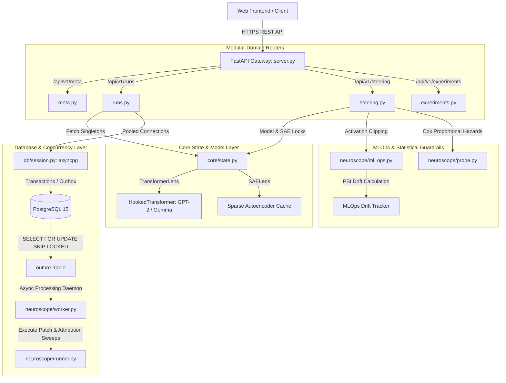
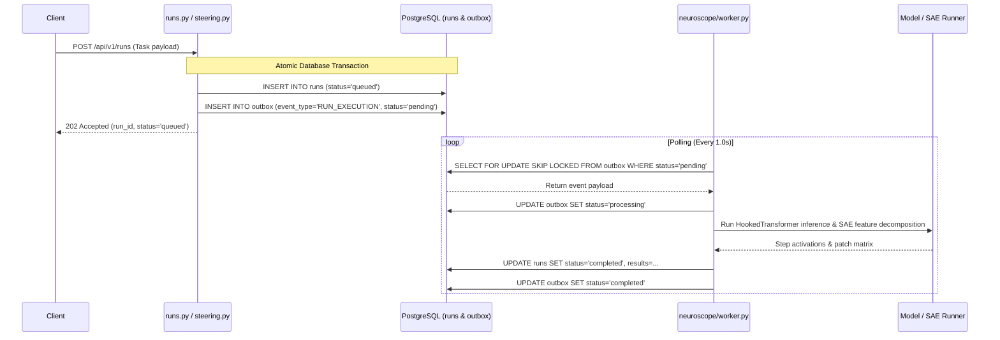

# NeuroScope v3 Architecture & System Design Specification

This document provides a principal-level engineering overview of **NeuroScope v3** — a high-throughput, concurrency-safe mechanistic interpretability and activation steering platform.

---

## 1. System Topology & Data Flow



---

## 2. Transactional Outbox Pattern & Background Workers

To prevent distributed state inconsistencies during long-running activation patching and steering sweeps, NeuroScope implements the **Transactional Outbox Pattern**:



---

## 3. PostgreSQL Advisory Locking & Concurrency Control

When multiple client requests or background workers attempt concurrent activation updates on the same run, NeuroScope prevents race conditions via session-level **PostgreSQL Advisory Locks**:

$$ \text{Lock ID} = \text{MD5}(\text{Resource UUID}) \pmod{2^{31} - 1} $$

```python
@asynccontextmanager
async def advisory_lock(key: str | uuid.UUID):
    lock_id = _key_to_int(key)
    async with pool.acquire() as conn:
        locked = await conn.fetchval("SELECT pg_try_advisory_lock($1)", lock_id)
        if not locked:
            raise HTTPException(status_code=409, detail="Resource currently locked")
        try:
            yield conn
        finally:
            await conn.execute("SELECT pg_advisory_unlock($1)", lock_id)
```

For immediate non-blocking database record locking, `SELECT ... FOR UPDATE NOWAIT` guarantees instantaneous `HTTP 409 Conflict` fast-failures without locking worker threads.

---

## 4. MLOps & Statistical Guardrails

### A. Population Stability Index (PSI) Drift Calculation
To monitor activation representation shift across autoencoder features, NeuroScope continuously calculates the PSI metric between current feature activation distributions and historical baseline distributions:

$$ \text{PSI} = \sum_{i=1}^{k} \left( P_{\text{actual}, i} - P_{\text{expected}, i} \right) \times \ln\left( \frac{P_{\text{actual}, i}}{P_{\text{expected}, i}} \right) $$

- **$\text{PSI} < 0.10$**: Stable representation.
- **$0.10 \le \text{PSI} \le 0.25$**: Moderate representation shift.
- **$\text{PSI} > 0.25$**: High drift alert logged to MLOps telemetry.

### B. Survival Hazard Hallucination Modeling
Rather than simple binary classification, hallucination probes model factual reasoning representation decay over reasoning steps using a **Censored Survival Hazard Model (Kaplan-Meier Estimation & Cox Proportional Hazards)**:

$$ S(t) = \prod_{t_i \le t} \left( 1 - \frac{d_i}{n_i} \right) $$

where $d_i$ is the number of factual reasoning failures at step $t_i$, and $n_i$ is the population at risk.

---

## 5. Directory Structure & Modularization

```
NeuroScope-main/
├── backend/
│   ├── api/
│   │   └── routers/
│   │       ├── meta.py         # Health checks, IOI benchmark metrics, suggested tasks
│   │       ├── runs.py         # Run lifecycle, step details, causal attribution, patching
│   │       ├── steering.py     # Activation steering hooks, linear probes, safety shields
│   │       └── experiments.py  # Pre-computed research baseline library
│   ├── core/
│   │   ├── state.py            # Global model & SAE singletons with mutex locks
│   │   └── logging_config.py  # Structured JSON telemetry logging
│   ├── db/
│   │   └── session.py          # asyncpg connection pool initialization
│   ├── neuroscope/
│   │   ├── db.py               # Advisory locks, outbox claims, relational queries
│   │   ├── ml_ops.py           # PSI drift calculation & semantic clipping
│   │   ├── probe.py            # Cox Proportional Hazards survival analysis probe
│   │   ├── worker.py           # Transactional outbox background polling daemon
│   │   ├── runner.py           # Model inference & activation extraction
│   │   ├── sae.py              # SAELens feature decomposition & sparse serialization
│   │   └── schema.sql          # PostgreSQL DDL schema with outbox & advisory locks
│   └── server.py               # Lightweight FastAPI application entrypoint
├── frontend/                   # Next.js 14 React frontend interface
├── .github/
│   ├── workflows/ci.yml        # Strict multi-stage CI/CD pipeline
│   └── PULL_REQUEST_TEMPLATE.md
├── ARCHITECTURE.md             # System topology and design document
├── CONTRIBUTING.md             # Git flow, conventional commits, local setup guide
└── docker-compose.yml          # Multicontainer orchestration (Postgres, Backend, Frontend)
```
