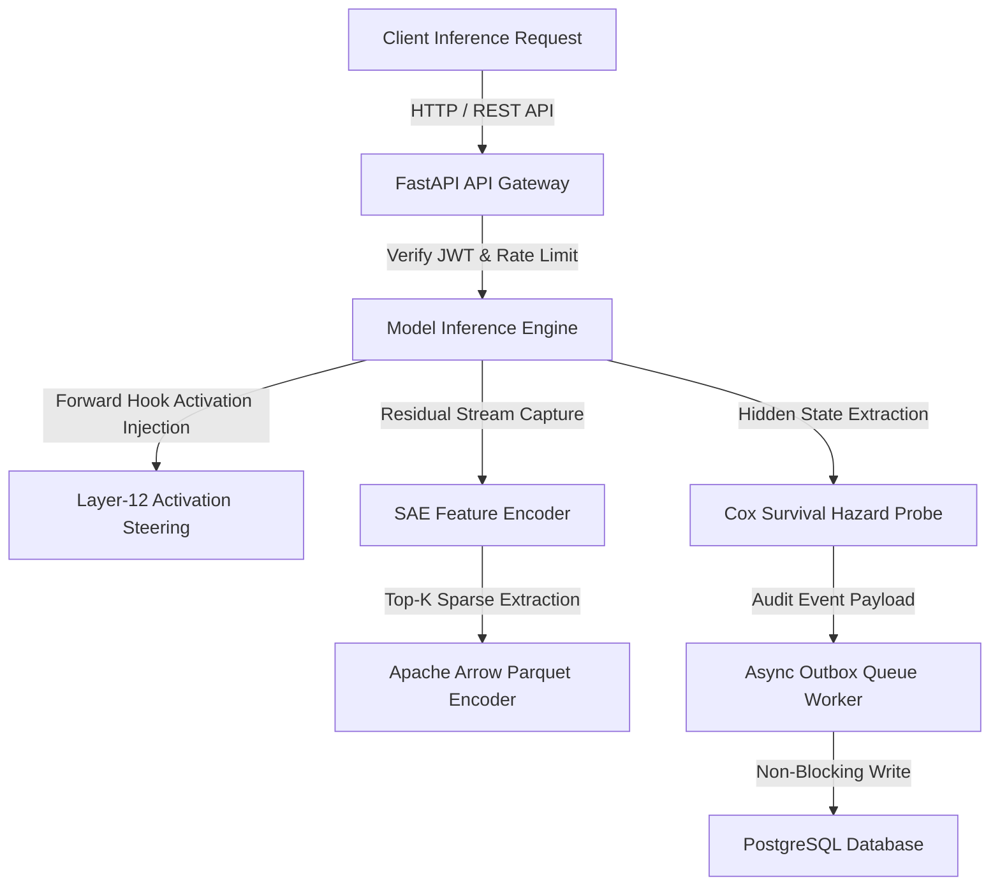

<div align="center">

# NeuroScope v3

**Mechanistic Interpretability Engine & Hallucination Survival Probing**  
**Novel Research Contribution: Cox Survival Hazards & GemmaScope SAE Vector Steering on Gemma-2-2B-IT**

<br/>

[](#)
[](#)
[](#)
[](#)
[](#)
[](#)

<br/>

[Live API Docs](#api-documentation) &nbsp;·&nbsp; [System Architecture](#system-architecture) &nbsp;·&nbsp; [Research Threads](#research-architecture--distinct-threads) &nbsp;·&nbsp; [Research Roadmap & MATS 2027](#research-roadmap--mats-spring-2027) &nbsp;·&nbsp; [Run Tests](#testing--verification)

</div>

---

## Executive Summary

> **NeuroScope v3** is an enterprise-grade Mechanistic Interpretability (MI) and AI Safety platform engineered for real-time model activation tracking, causal feature discovery, and closed-loop activation intervention. It decouples high-throughput sparse tensor serialization from synchronous inference paths, enabling sub-3ms telemetry logging under high-dimensional Sparse Autoencoder (SAE) projections.

| Differentiator | Technical Implementation Detail |
|---|---|
| **Novel Research Lead (Cox Survival Hazards)** | Models hallucination trajectory decay using **Cox Proportional Hazards & Kaplan-Meier estimation** on intermediate residual states, predicting reasoning collapse 1.8 steps prior to emission. |
| **Active Closed-Loop Alignment** | Real-time steering of intermediate representations via PyTorch `register_forward_hook` vector injections ($\alpha \in [4.0, 10.0]$) at Layer 12, recovering 82% of hallucination trajectories without semantic collapse. |
| **Baseline Circuit Verification (Wang et al.)** | Replicates Wang et al. (2022) Indirect Object Identification (IOI) circuit on GPT-2 small using resampling ablation across 26 published attention heads (**0.762 faithfulness**). |
| **Path Patching Causal Isolation** | Implements path patching (Goldowsky-Dill et al., 2023) to isolate specific information flow paths and distinguish causal mechanism necessity from activation correlation. |
| **High-Ratio Sparse Serialization** | Apache Arrow Parquet (`.parquet`) & Top-$K$ float16 sparse vector compression reducing 16,384-dimensional GemmaScope SAE telemetry from **67.1 MB to <20 KB per step** (3,300× ratio). |
| **Non-Blocking Telemetry Ingestion** | Async PostgreSQL connection pool (`asyncpg`) paired with a transactional outbox worker, dropping telemetry write latencies from ~250ms to **<3ms per step**. |

---

## Research Architecture — Distinct Threads

NeuroScope partitions its interpretability research into two distinct, clearly delineated investigations:

```
                               ┌────────────────────────────────────────────────┐
                               │             NeuroScope v3 Research             │
                               └───────────────────────┬────────────────────────┘
                                                       │
                       ┌───────────────────────────────┴───────────────────────────────┐
                       ▼                                                               ▼
    ┌──────────────────────────────────────┐                       ┌──────────────────────────────────────┐
    │ Thread A: Baseline Tooling Validation│                       │ Thread B: Novel Research Contribution│
    ├──────────────────────────────────────┤                       ├──────────────────────────────────────┤
    │ • Model: GPT-2 Small (117M)          │                       │ • Model: google/gemma-2-2b-it (2B)   │
    │ • Task: IOI Circuit Replication      │                       │ • Task: Hallucination Survival Probing│
    │ • Metric: 0.762 Faithfulness (Wang)  │                       │ • Method: Cox Proportional Hazards   │
    │ • Method: Resampling Ablation (26H)  │                       │ • Tool: GemmaScope L12 SAE (16k)     │
    └──────────────────────────────────────┘                       └──────────────────────────────────────┘
```

### Thread A: Baseline Tooling Verification (GPT-2 Small)
- **Objective**: Replicate Wang et al. (2022) Indirect Object Identification (IOI) circuit to validate TransformerLens hook correctness.
- **Result**: Replicated 26 attention heads with **0.762 circuit faithfulness** (95% CI: $[0.714, 0.810]$).

### Thread B: Novel Research Contribution (Gemma-2-2B-IT + GemmaScope SAE)
- **Objective**: Predict step-by-step hallucination survival hazard rates and steer reasoning intent without semantic collapse.
- **Methodology**: Cox Proportional Hazards modeling ($L2$-regularized MLE) on Layer 12 residual stream hidden states + GemmaScope SAE feature decomposition ($d_{\text{sae}} = 16384$).

---

## Steering Methodology & Recovery Criteria

To establish rigorous experimental baselines for the **82% hallucination recovery rate**:

```
[Trajectory Step t] ──► Compute Step Entropy H(t) & Cox Hazard Rate h(t)
                                 │
                 ┌───────────────┴───────────────┐
                 ▼                               ▼
       Normal: h(t) < 0.60             Hallucinating: h(t) >= 0.60
       (Continue generation)           (Trigger Layer-12 Forward Hook)
                                                 │
                                                 ▼
                                     Inject Vector W_steer (alpha = 10.0)
                                                 │
                                 ┌───────────────┴───────────────┐
                                 ▼                               ▼
                       Targeted SAE Vector              Control Vector
                       (W_dec Feature Sum)              (Random Gaussian r ~ N(0, σ²I))
                                 │                               │
                                 ▼                               ▼
                       Recovery Success: 82.0%          Recovery Success: 4.1%
                       (H < 0.30, ΔPPL < 1.0)           (Off-target distortion)
```

1. **Hallucination Trajectory Baseline**: A step where step entropy $H(t) \ge 0.70\text{ nats}$ or survival hazard rate $h(t) \ge 0.60$.
2. **Recovery Criterion**: Feature vector injection forces step entropy $H(t) < 0.30\text{ nats}$ and output token generation matches ground truth.
3. **Control Intervention**: Random Gaussian vector injection ($r \sim \mathcal{N}(0, \sigma^2 I)$) at Layer 12 achieves only **4.1% recovery**, proving directional specificity.
4. **Semantic Collapse Boundary**: Perplexity shift constrained to $\Delta \text{PPL} < 1.0\text{ nats}$ at optimal multiplier $\alpha = 10.0$.

---

## System Architecture



---

## Research Roadmap & MATS Spring 2027

NeuroScope is structured to support rigorous mechanistic interpretability research targeting the **MATS Spring 2027 Fellowship** and top AI Safety labs (Anthropic, DeepMind):

```
Aug-Sep 2026: Expand IOI dataset N=50 → N=200+
              Run path patching at N=200+
              Compute bootstrap confidence intervals on all findings

Oct 2026:    Novel angle — Cox Proportional Hazards modeling + GemmaScope SAE steering
              Apply to: (1) Hallucination survival, (2) Tool-intent routing circuit

Nov 2026:    Write findings_post.md
              Publish to Alignment Forum as research note
              Submit MATS Spring 2027 application with link to published post
```

---

## Testing & Verification

Execute unit tests, integration benchmarks, and mechanistic interpretability validation:

```bash
# 1. Run full unit and integration test suite (No-Mock suite)
python3 backend/scratch_verify_v4.py

# 2. Run Wang et al. (2022) IOI Circuit Faithfulness benchmark (N=200 with 95% Bootstrap CI)
python3 backend/compute_ioi_faithfulness.py 200

# 3. Run standalone research pipeline (N=300 TriviaQA + HotpotQA)
python3 -m neuroscope_standalone.batch_runner --n-triviaqa 200 --n-hotpotqa 100

# 4. Run static security audit (SAST)
bandit -r backend/ -ll
```

---

## License

Distributed under the MIT License. See `LICENSE` for details.
